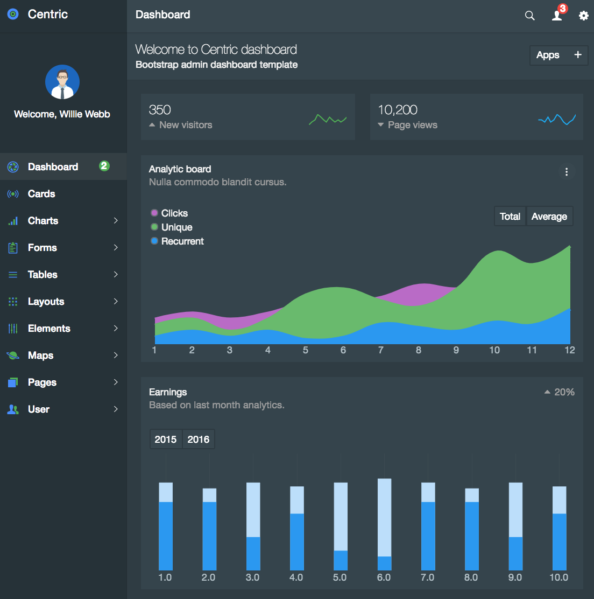

# React Centric
> React + Redux with [Centric](https://wrapbootstrap.com/theme/centric-bootstrap-admin-template-WB0901P31) theme

[![Build Status][travis-image]][travis-url]
[![Dependency Status][david-image]][david-url]
[![devDependency Status][david-image-dev]][david-url-dev]
[![Open Source Love][os-image]][os-url]
[![PRs Welcome][pr-image]][pr-url]

Front-end platform for build several open source tools integration including collaboration, agile projects and online sales.



## Usage example

Feel free to use it for learn, contribute and build your own system.

_For more examples and usage, please refer to the [Wiki][wiki-url] and [PivotalTracker][pivotal-url]._


## Installation

You need to have [Node.js][node-url] and [yarn][yarn-url] (faster then npm) pre-installed. You can use npm if you do not have yarn.

### Development setup

```sh
yarn install
yarn start
```

### Build setup

```sh
yarn install
yarn build
```

## Release History

* 0.0.2
    * Work in progress

## Meta

Sergei Smirnov – [@sergo_us](https://twitter.com/sergo_us) – sergous@gmail.com

Distributed under the ICS license. See ``LICENSE`` for more information.

[https://github.com/sergous/react-centric](https://github.com/sergous/)

## Contributing

Kanban development board with current tasks on 
[ PivotalTracker][pivotal-url].

1. Fork it (<https://github.com/sergous/react-centric/fork>)
2. Create your feature branch (`git checkout -b feature/fooBar`)
3. Commit your changes (`git commit -am 'Add some fooBar'`)
4. Push to the branch (`git push origin feature/fooBar`)
5. Create a new Pull Request

<!-- Markdown link & img dfn's -->
[repo-url]: https://github.com/sergous/react-centric
[wiki-url]: https://github.com/sergous/react-centric/wiki
[travis-image]: https://travis-ci.com/sergous/react-centric.svg?branch=staging
[travis-url]: https://travis-ci.com/sergous/react-centric
[pivotal-url]: https://www.pivotaltracker.com/n/projects/1582495
[os-image]: https://badges.frapsoft.com/os/v2/open-source.svg?v=103
[os-url]: https://github.com/ellerbrock/open-source-badges
[david-image]: https://david-dm.org/boennemann/badges.svg
[david-url]: https://david-dm.org/sergous/react-centric
[david-image-dev]: https://david-dm.org/boennemann/badges/dev-status.svg
[david-url-dev]: https://david-dm.org/sergous/react-centric#info=devDependencies
[pr-image]: https://img.shields.io/badge/PRs-welcome-brightgreen.svg?style=flat-square
[pr-url]: http://makeapullrequest.com
[node-url]: https://nodejs.org
[yarn-url]: https://yarnpkg.com
